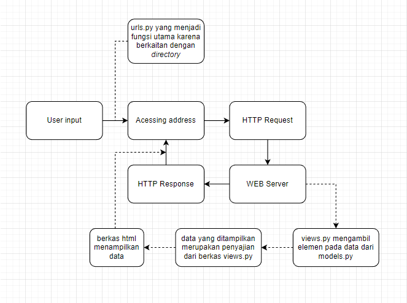

[Tugas 2 Pemrograman Berbasis Platform]

Nama	: Muhammad Navis Raditya Riayatsyah

NPM	: 2106717291

* Link menuju aplikasi Heroku yang sudah di-*deploy* : https://pbp-tugas02.herokuapp.com/
* Yang terjadi ketika terdapat *client request* pada aplikasi dan kaitan antara urls.py, models.py, views.py, dan berkas html pada aplikasi.

  
* Digunakannya *virtual environment* adalah untuk memastikan bahwa aplikasi yang kita buat dapat stabil di tempat manapun itu. Misalkan *developer* membuat sebuah aplikasi dan menggunakan versi tertentu dari Django. Maka dengan *virtual environment*, aplikasi tersebut juga akan berjalan dengan versi Django yang sama dengan *developer*.
* Cara pengimplementasian poin 1 sampai 4:

  1. Dengan menambahkan fungsi yang memuat Nama, NPM, dan List Barang pada *class*,.
  2. *Routing* terjadi dengan cara me-*refer* variabel yang berisikan List Barang di *class* views.py dengan *class* models.py.
  3. Diberlakukan *looping* pada *file* katalog.html sebagai pemanggilan setiap elemen yang ada pada List Barang.
  4. *Deployment* dilakukan dengan melalui heroku.com dengan menautkan *repository* GitHub untuk aplikasi terkait.
