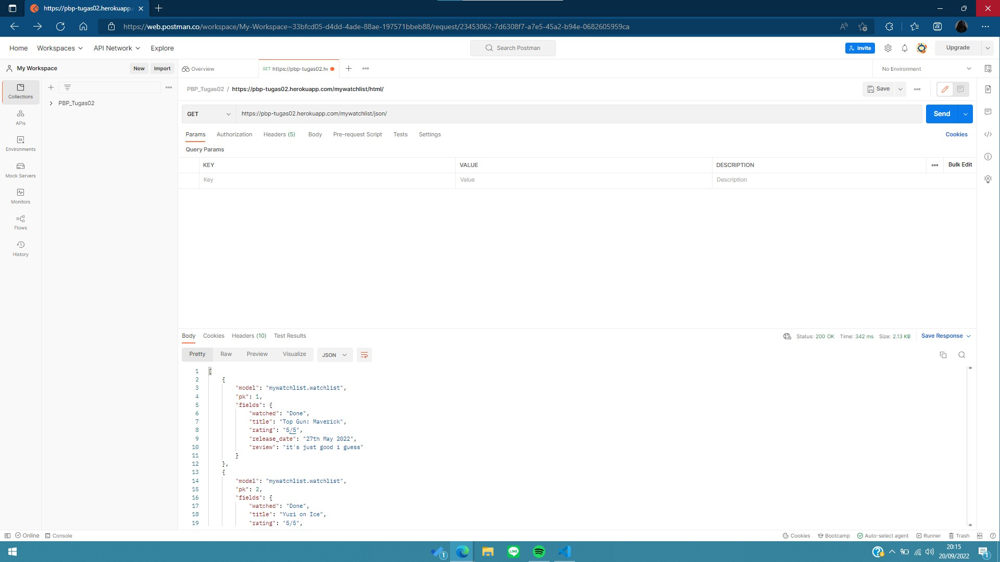
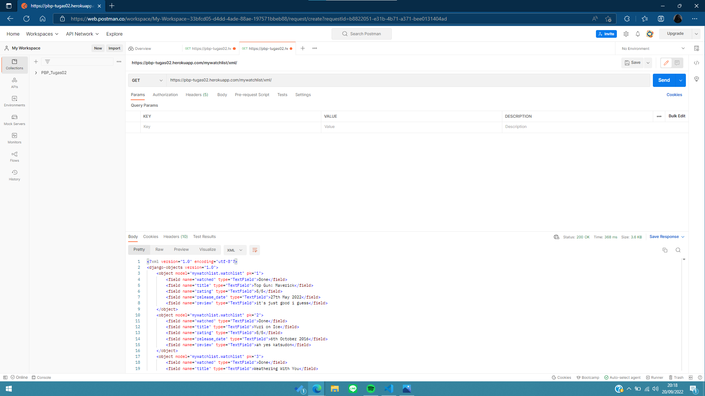
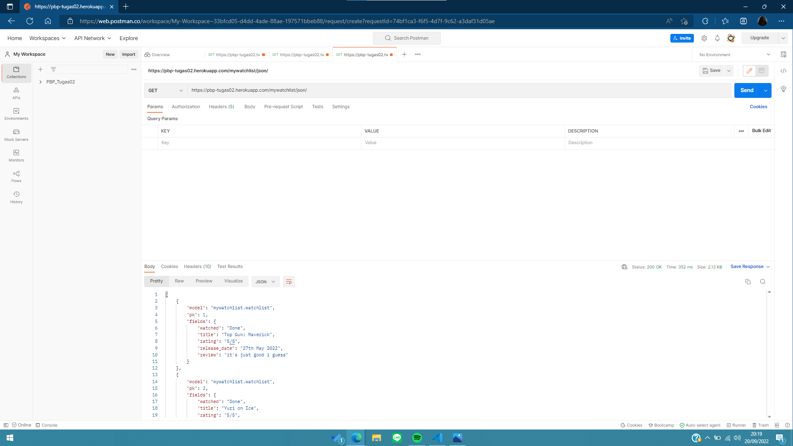

[Tugas 3]

**Pengimplementasian Data Delivery Menggunakan Django**

Nama	:	Muhammad Navis Raditya Riayatsyah

NPM	:	2106717291

Kelas	:	PBP-C

*Link* untuk mengakses file HTML, JSON, dan XML untuk aplikasi mywatchlist:

- https://pbp-tugas02.herokuapp.com/mywatchlist/html/
- https://pbp-tugas02.herokuapp.com/mywatchlist/xml/
- https://pbp-tugas02.herokuapp.com/mywatchlist/json/

Perbedaan antara JSON, XML, dan HTML

- HTML berfungsi sebagai 'interface' utama dan terdepan dalam sebuah *website*. Segala teks yang kita lihat dari sebuah laman *website* merupakan HTML. Dalam kata lain, HTML menampilkan segala sesuatu yang berhubungan dengan text pada sebuah laman *web*.
- JSON berfungsi sebagai tempat untuk menyimpan *database* yang akan ditampilkan pada HTML. Akan tetapi, apabila terjadi pemanggilan terhadap JSON, maka akan ditampilkan sebuah List dengan banyak elemen yang elemennya merupakan sebuah HashMap dan tanpa format tambahan dalam penampilannya. Sehingga data yang ditampilkan berantakan.
- XML pada intinya memiliki fungsi yang sama dengan JSON, akan tetapi XML menampilkan data dengan format penampilan sehingga data yang ditampilkan sudah rapih dan mudah untuk dilihat.

Alasan diperlukannya *data delivery* dalam sebuah *platform*

- Agar apabila disajikan data pada sebuah *database*, kita bisa gunakan setiap data yang ada pada *database* tersebut di setiap pemanggilan dimanapun itu.

Caraku mengimplementasikan *checklist* pada soal

- Dibuatnya *file* .json yang berisikan data-data yang ingin disajikan pada *file* .html dari aplikasi terkait.
- Menyiapkan *template* bagi setiap elemen yang ada pada *database* dengan menambahkan jenisnya pada models.py
- *Database* dipanggil dengan iterasi pada *file* mywatchlist.html.
- Mempersiapkan pemanggilan *data* pada *database* dengan menambahkan fungsi pada views.py.
- Menambahkan *path* untuk mengakses aplikasi mywatchlist pada urls.py yang ada di aplikasi project_django, serta menambahkan *path* terkait untuk mengakses data dalam bentuk JSON atau XML pada urls.py yang ada di aplikasi mywatchlist.

*Link* dari aplikasi mywatchlist jika diakses menggunakan Postman

- HTML:
- XML:
- JSON: 
